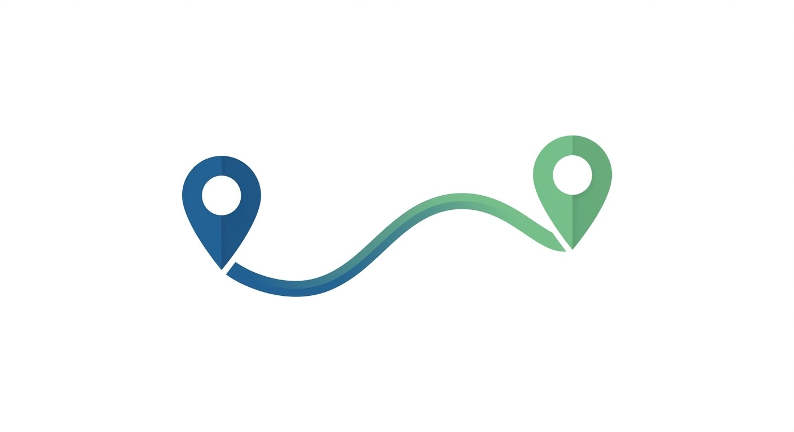

# RouteShare

<p align="center">
  
</p>

<p align="center">
  <strong>The simplest way to draw and share custom map routes.</strong>
</p>

<p align="center">
  <a href="https://github.com/viviienn/RouteShare/blob/main/LICENSE">
    
  </a>
  <a href="https://nextjs.org/">
    
  </a>
  <a href="https://www.mapbox.com/">
    
  </a>
  <a href="https://supabase.com/">
    
  </a>
</p>

---

## 🚀 About RouteShare

**RouteShare** is an open-source tool designed for quickly sketching delivery, driving, or walking routes and sharing them via a unique, mobile-responsive link. Whether you're coordinating with a driver or planning a run, RouteShare makes geographic communication instant and effortless.

## Why?
**Important**
Tired of delivery drivers getting lost because default maps took them to the wrong entrance? RouteShare fixes that. Just drop a pin for the driver, drop one for yourself, and draw the exact path they need to take. Generate a link, text it over, and get your food while it's still hot.

RouteShare as a Standalone Proof-of-Concept

This is a web app that demonstrates custom route sharing. While it currently requires manual pin placement and link sharing, the real vision is for this to be integrated directly into delivery platforms.

If implemented natively:
- The driver's location would auto-populate from GPS
- Your pickup point would pre-fill from your order address
- Routes would be shared instantly through the in-app chat (no external links)
- The entire flow would be seamless and require zero setup

This project exists to show what's possible when you let users draw their own routes instead of relying on default navigation that often gets confused by complex entrances, gates, or campus layouts.


## ✨ Features

- 📍 **Geolocation Support**: Instantly center the map on your current position.
- ⚙️ **Route Maker Modes**: Choose between *Automatic* (fetches real-world driving paths via OSRM) or *Manual* drawing modes.
- 🎨 **Interactive Drawing & Snapping**: High-contrast drawing tools with endpoints that magnetically snap to your pins.
- 📌 **Custom Markers**: Explicit "Driver Start" (Blue) and "Destination" (Red) pins.
- 🔗 **Instant Link Generation**: Save your route to Supabase and get a shareable URL in one click.
- 📱 **Mobile Optimized**: Fully responsive interface designed for use in the field.
- 🛡️ **Security First**: Server-side rate limiting and hardened Supabase RLS policies.

## 🛠️ Tech Stack

- **Framework**: [Next.js 16](https://nextjs.org/) (App Router)
- **Maps**: [Mapbox GL JS](https://www.mapbox.com/mapbox-gljs) & [Mapbox Draw](https://github.com/mapbox/mapbox-gl-draw)
- **Styling**: [Tailwind CSS v4](https://tailwindcss.com/)
- **Animations**: [Framer Motion](https://www.framer.com/motion/)
- **Backend**: [Supabase](https://supabase.com/) (PostgreSQL + RLS)
- **Icons**: [Lucide React](https://lucide.dev/)

## ⚙️ Setup & Installation

### 1. Clone the repository
```bash
git clone https://github.com/viviienn/RouteShare.git
cd RouteShare
```

### 2. Install dependencies
```bash
npm install
```

### 3. Configure Environment Variables
Create a `.env.local` file in the root directory:
```bash
NEXT_PUBLIC_MAPBOX_TOKEN=your_mapbox_public_token
NEXT_PUBLIC_SUPABASE_URL=your_supabase_project_url
NEXT_PUBLIC_SUPABASE_ANON_KEY=your_supabase_anon_key
```

### 4. Database Setup
Run the SQL found in [`supabase/schema.sql`](supabase/schema.sql) in your Supabase SQL Editor to initialize the `routes` table and security policies.

### 5. Start the engine
```bash
npm run dev
```

## 🚢 Deployment

Deploy your own instance of RouteShare on Vercel:

[](https://vercel.com/new/clone?repository-url=https%3A%2F%2Fgithub.com%2Fviviienn%2FRouteShare)

## ⚖️ License

Distributed under the **Apache 2.0 License**. See `LICENSE` for more information.
